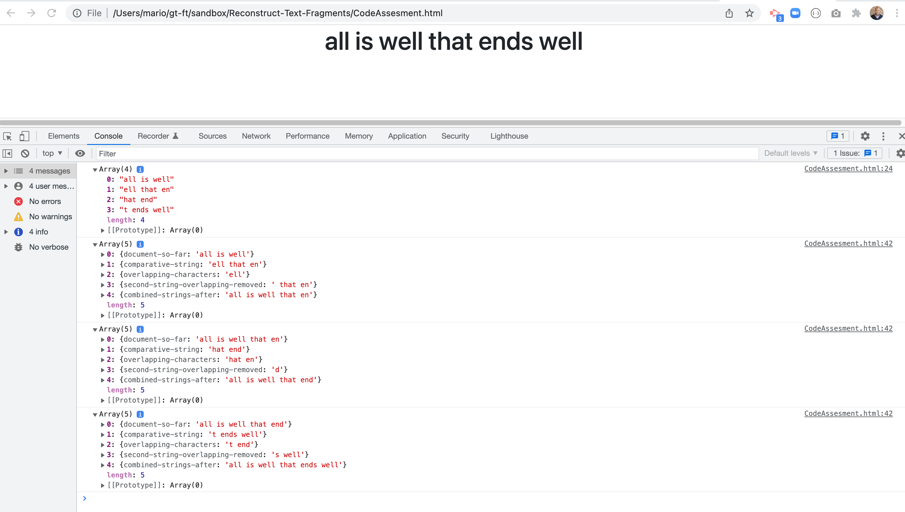

# Reconstruct-Text-Fragments

[View the deployed application here](https://marioreid.github.io/Reconstruct-Text-Fragments/)
# Table of Contents

* [About the Project](#about-the-project)
* [Getting Started](#getting-started)
* [Installation](#installation)
* [Usage](#usage)
* [Contributing](#contributing)
* [License](#license)

## About the Project 
Write a program that reads a file of text fragments and attempts to reconstruct the original document
out of the fragments. The fragments were created by duplicating the original document many times
over and chopping each copy into pieces. The fragments overlap one another and your program will
search for overlaps and align the fragments to reassemble them into their original order.

* Preview of the project/screenshot 

### Getting Started 
View deployed website

### Installation 

1.  `Clone the repo`
    `git clone git@github.com:MarioReid/Reconstruct-Text-Fragments.git`

2.  `run application in your local host`

### Usage 

As a user, I want an application that allows me to take fragments and run to form a complete sentence. 

### Contributing

The following individual contributed to the success of this application. You can view their Github profiles by clicking on their name:

* [Mario Reid](https://github.com/MarioReid)  

### License  

MIT License
Copyright (c) 2022  Mario Reid 
Permission is hereby granted, free of charge, to any person obtaining a copy
of this software and associated documentation files (the "Software"), to deal
in the Software without restriction, including without limitation the rights
to use, copy, modify, merge, publish, distribute, sublicense, and/or sell
copies of the Software, and to permit persons to whom the Software is
furnished to do so, subject to the following conditions:
The above copyright notice and this permission notice shall be included in all
copies or substantial portions of the Software.
THE SOFTWARE IS PROVIDED "AS IS", WITHOUT WARRANTY OF ANY KIND, EXPRESS OR
IMPLIED, INCLUDING BUT NOT LIMITED TO THE WARRANTIES OF MERCHANTABILITY,
FITNESS FOR A PARTICULAR PURPOSE AND NONINFRINGEMENT. IN NO EVENT SHALL THE
AUTHORS OR COPYRIGHT HOLDERS BE LIABLE FOR ANY CLAIM, DAMAGES OR OTHER
LIABILITY, WHETHER IN AN ACTION OF CONTRACT, TORT OR OTHERWISE, ARISING FROM,
OUT OF OR IN CONNECTION WITH THE SOFTWARE OR THE USE OR OTHER DEALINGS IN THE
SOFTWARE.